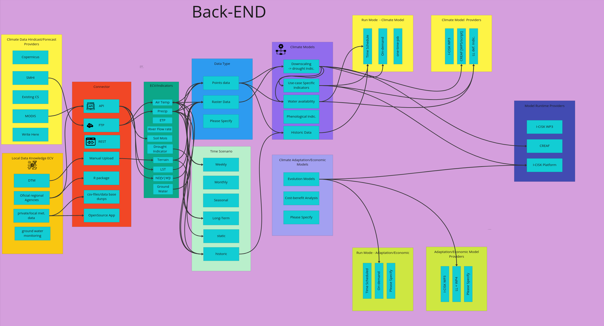
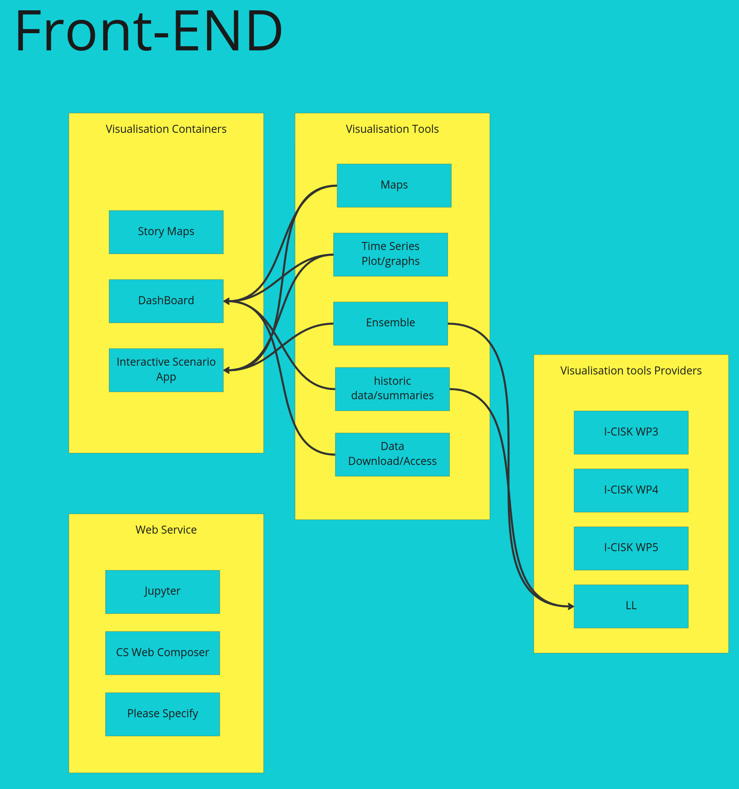
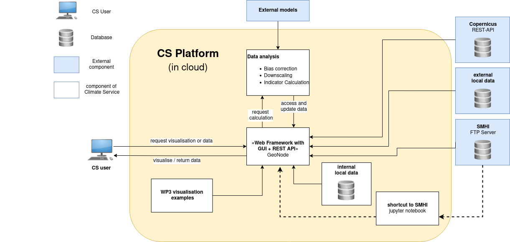
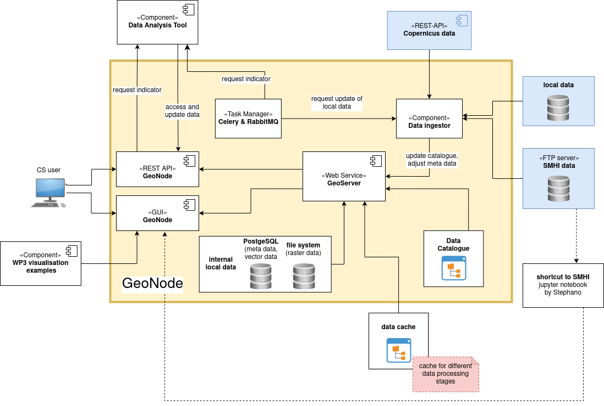
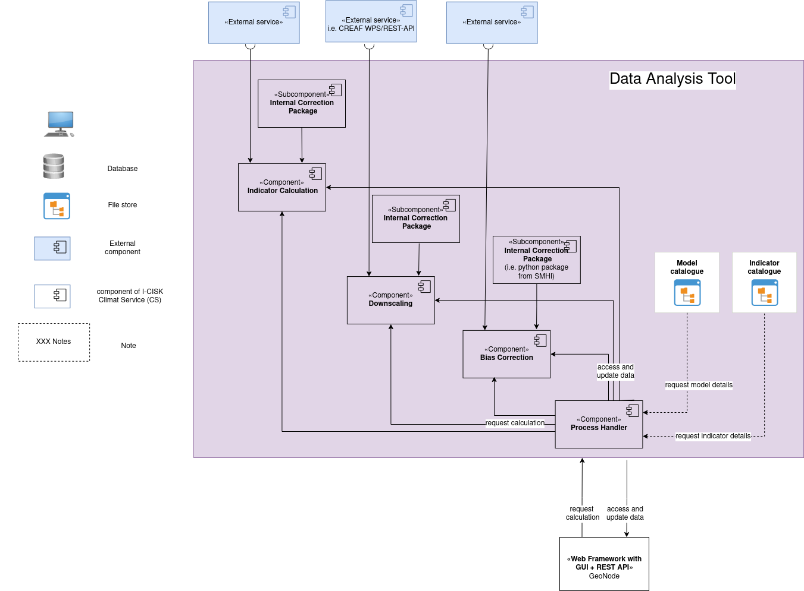
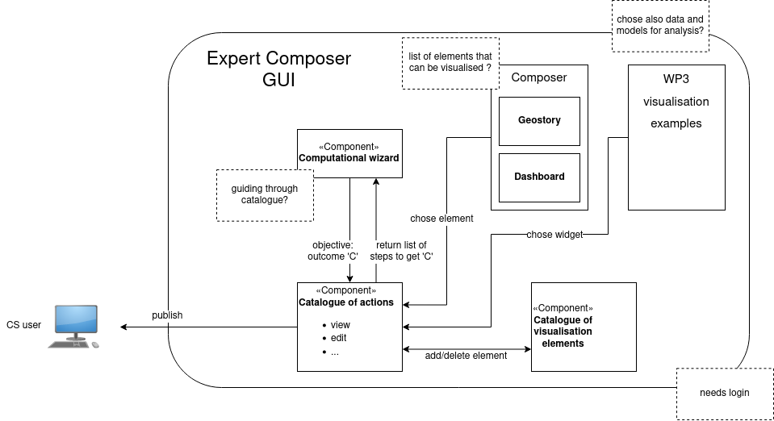
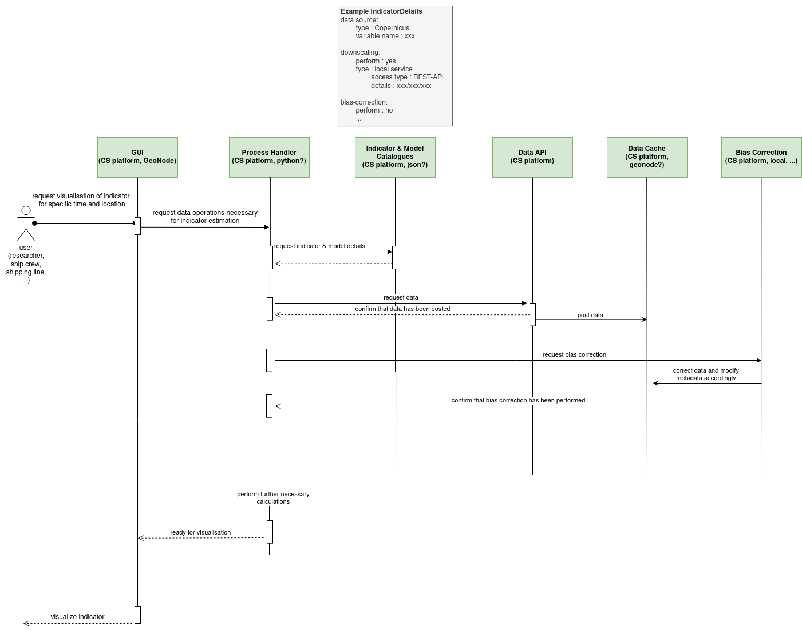

# 

**About arc42**

arc42, the template for documentation of software and system
architecture.

Template Version 8.1 EN. (based upon AsciiDoc version), May 2022

Created, maintained and © by Dr. Peter Hruschka, Dr. Gernot Starke and
contributors. See <https://arc42.org>.

# Introduction and Goals {#section-introduction-and-goals}
This document describes the architecture for the Climate Service designed for the I-CISK project.

## Requirements Overview {#_requirements_overview}
The Climate Service for the I-CISK project aims to fulfill the following goals:

- provide access to environmental data both from *external* services (e.g. from the Copernicus Program [], the Swedish Meteorological and Hydrological Institute (SMHI) []) as well as a variety of local data sources;

- integrate analysis chains for indicator calculations which are developed in I-CISK WP3 and WP4,

- provide visualisation tools for the indicators;

- provide stakeholders with the possibility to easily extend the existing functionality by modifying and adding individual components as well as setting up a new CS with a dedicated AUTO CS Composer

## Quality Goals {#_quality_goals}
<table>
  <caption style="text-align:center"> Table 1: List of Quality Scenarious.</caption>
  <tbody>
    <tr>
      <th align="left">Scenario ID</th>
      <th align="left">Scenario</th>
    </tr>
    <tr>
      <td>SC1</td>
      <td> The visualisation of the climate indicators is comprehensive and adapted to the stakeholders needs such that the CS users can interpret the results without the need for further background knowledge.
     </td>
    </tr>
    <tr>
      <td>SC2</td>
      <td> Models and data are integrated in the CS in a modular way such that individual components can be combined for the calculation of different indicators in a flexible way and further components can be added without changing the core architecture.
     </td>
    </tr>
    <tr>
      <td>SC3</td>
      <td> The AUTO CS Composer enables stakeholders without computational background knowledge to combine different data sets and analysis steps to build their own tailored CS.</td>
    </tr>
    <tr>
      <td>SC4</td>
      <td> The software is well documented and easy to operate such that stakeholders with reasonable background knowledge can extend the software functionality of the CS also after the project duration without further support.
     </td>
    </tr>
  </tbody>
</table>

## Summary of stakeholder requirements for each Living Lab {#_stakeholders}
This  section summarises the current status of the properties that have been identified as necessary for the individual CS components by the LL leaders. Thereby, the requirements for the back-end are collected separately from those for the front-end. The individual components that are considered for the **back end** are the

- Climate Data Hindcast/Forecast Providers (the external data recources excluding local recources)

- Local Data Knowledge ECV (the local data recources)

- EVC/Indicators (the target variables)

- Data Types (the data types of the indicators)

- Time Scenario (the time periods over which the indicators are aggregated)

- Climate Models (models necessary to obtain the target indicators)

- Climate Adaption/Economic Models (models which investigate the climate response of indicators to adaption strategies)

- Run Mode of Climate Model and Adaption/Economic models (the run mode of climate and adaption models)

- Climate Model and Adaption/Economic Model Providers (external services or I-CISK WPs that provide the models)  

On the other hand, the components which are relevant for the **front end** are the

- Visualisation Containers 

- Visualisation Tools

- Visualisation Tool Providers

- Web Service  

### Requirements of LL1 {#_stakeholders}

<figure>
  
  <figcaption>Figure 1: Schematical view of the individual components that have been identified for the LL1</figcaption>
</figure>

<figure>
  
  <figcaption>Figure 1: Schematical view of the individual components that have been identified for the LL1</figcaption>
</figure>

### Summary of requirements regarding CS architecture
<table>
  <caption style="text-align:center"> Table 1: Selection of stakeholders for each living lab and their expectations regarding the CS functionality and architecture. If there is a focus on a particular group of stakeholders, this group is marked by (*).</caption>
  <tbody>
    <tr>
      <th align="left">Living Lab</th>
      <th align="left">Stakeholder profession</th>
      <th align="left">Expectations regarding CS architecture</th>
    </tr>
    <tr>
      <td>Spain LL (LL1)</td>
      <td>Olive Farmers Dairy Farmers on Oak-/Grassland</td>
      <td>develop full CS that
        <ul>
          <li>provides a mobile app</li>
          <li>provides weekly and long-term forecasts
          <li>enabels to compare current climate data to historical data</li>
        </ul>
      </td>
    </tr>
    <tr>
      <td>Greece LL (LL4)</td>
      <td>developement company of Crete responsible for water management (*)  NGOs municipality of port Rethimno Greek National touris organisation representatives of luxury hotel sector </td>
      <td> develop full CS that 
        <ul>
          <li>provides forecasts on time scales from monthly to seasonal</li>
          <li>provides climate projections</li>
        </ul>
      </td>
    </tr>
    <tr>
      <td>Lesotho LL (LL7)</td>
      <td> National Disaster Management Team District Disaster Management Teams Community Based Disaster Response Teams Village Disaster Management Teams National University of Lesotho</td>
      <td> connect to an existing CS i.e.
        <ul>
          <li>provide WMS that can be accessed by excisting multi-active platform (IBF-system [1]) via an API</li>
          <li>set up data analysis pipeline for weekly to seasonal forecasts that can be integrated in IBF-system after project run time</li>
        </ul>
      </td>
    </tr>
  </tbody>
</table>

[1] IBF-system, accessible via [https://github.com/rodekruis/IBF-system](https://github.com/rodekruis/IBF-system)

# Architecture Constraints {#section-architecture-constraints}
The CS software needs to meet the following constraints:

- since the final CS will be an open-access platform, the CS framework should only apply open-source software

- to assure interoperability of data and models, the CS framework will implement OGC standards and follow the INSPIRE implementing rules

#
# System Scope and Technical Context {#section-system-scope-and-context}

Figure 1 shows the major interfaces of the CS architecture to the CS user as well as external model providers and data recources. The user will be able to access the CS via a graphical user interface (GUI) and a REST-API. Due to the large variaty with respect to the developement stages of the individuel components, the communication protocols between the CS and the external components are so far only defined for some cases. The communication protocols for the other components will be characterised in the further course of the I-CISK project. For the components which are already more advanced, the communication protocols are indicated in Figure 1 and they are listed in Table X together with the corresponding providers.

<figure>
  
  <figcaption>Figure 1: Schematical view of the individual components that have been identified for the LL1</figcaption>
</figure>

<int name="interfaces">
<table>
  <caption style="text-align:center"> XXX </caption>
  <tbody>
    <tr>
      <th align="left">Component Group</th>
      <th align="left">Individual Components</th>
      <th align="left">Provider</th>
      <th align="left">Protocol</th>
      <th align="left">LL</th>
    </tr>
    <tr>
      <th>Exernal Data</th>
      <td>SMHI data</td>
      <td>SMHI</td>
      <td>FTP</td>
      <td>several</td>
    </tr>
    <tr>
      <th></th>
      <td>Copernicus</td>
      <td>Copernicus</td>
      <td>REST-API</td>
      <td>several</td>
    </tr>
 <tr>
      <th>Local Data</th>
      <td>Luftdaten</td>
      <td>openSenseMap</td>
      <td>API</td>
      <td>Hungary LL</td>
    </tr>
 <tr>
      <th></th>
      <td>iNaturalist</td>
      <td>iNaturalist</td>
      <td>TBD</td>
      <td>Hungary LL</td>
    </tr>
<tr>
      <th></th>
      <td>droogte/zomermonitor</td>
      <td>water board rijnland</td>
      <td>PDF download</td>
      <td>Rijnland LL</td>
    </tr>
    <tr>
      <th>Models</th>
      <td>CREAF downscaling</td>
      <td>CREAF</td>
      <td>WMS or REST-API</td>
      <td>Spain LL</td>
    </tr>
  </tbody>
</table>
</int>

# Solution Strategy {#section-solution-strategy}

- run everything in a cluster -> have flexible computation recources
- wrap everything in a docker container -> dependency management ...

# Building Block View {#section-building-block-view}

## Whitebox Overall System {#_whitebox_overall_system}
Going into more detail about the CS architecture, Figure X illustrates the Level 1 components. All these components will be deployed in an XXX cloud []. The major responsibilities of the corresponding building blocks are

- **GeoNode web framework**: GeoNode is a web framework that provides basic functionalities for the developement of spatial data infrastructures based on open sources software []. For the CS platform, the available features will be extended and modified according to the architecture requirements.  
The major repsonsibilities of the GeoNode module include the visualisation of climate indicators via a GUI on the one hand and the provision of an access point to I-CISK web map services and data recources via an REST-API on the other hand. Internally, the GeoNode REST-API implements the communication interface between the Data Analysis Tool and the data storage components. The GeoNode web service also contributes with data  and task management tools.

- **WP3 visualisation toolbox**: The visualisation examples developed by WP3 of the I-CISK project will be integrated in the GeoNode GUI. (?)

- **Internal local data**: For serveral LLs (e.g. Italy), local data will be uploaded manually to the CS platform and will be stored on internal capacities.

- **Data Analysis Tool**: The calculation of the climate indicators is performed in the Data Analysis Tool. Necessary calculations steps include bias correction and downscaling procedures. Whereas for some indicators the respective models will run as components within the I-CISK platform, the estimation of other parameters requires the connection of external models.
#
Do we need to also define the interfaces already?

## Level 2 {#_level_2}

### White Box GeoNode web framework {#_white_box_emphasis_building_block_1_emphasis}
#
<figure>
  
  <figcaption>Figure 1: Schematical view of the individual components that have been identified for the LL1</figcaption>
</figure>
#
The GeoNode web framework is built from various components of which some are mandadory and some can be used on demand. Figure XXX shows the decomposition of the GeoNode components that will be used for the I-CISK platform. These components have the following responsibilities:

- **GUI**: The GUI enables the CS user to request the calculation and visualisation of particular indicators. It allows for interactive adjustment of calculation constraints. For example, it allows the user to change the time period over which data is aggregated for a selection of indicators with a slider or similar. The GUI also comes with a toolbox that enables the user to autonomously compose dedicated CS by combining different analysis procedures and data sets.

- **REST-API**: The REST-API provides an access point for external services to services and data sets of the CS framework.

- **Internal local data**: Local data that will be uploaded manually to the CS platform will be stored in a PostgreSQL data base in case of vector data and in the file system in  case of raster data. Also, meta data will be stored in the PostgreSQL data base.

- **Task Manager**: Tasks that need to be executed on a regular basis, e.g. the update of local data recources, can be scheduled in GeoNode using a combination of Celery and RabbitQM. Whereas Celery organises the task queue and task ´excecution, RabbitQM constitutes the message broker. 

- **GeoServer**:  The calculation results will be published by GeoServer which implements OGC standards.

- **Data Ingestor**: The data ingestor component will read the data from the various recources and bring it into a format that is suitable for the data analysis. It adjusts the meta data to the OGC standards and ? transforms it into netCDF files? 

- **Data Catalogue**: GeoNode provides a data catalogue in which data is registered with the appropriate meta data. The metadata is generated from a Django relation database and published via pycsw.

### White Box Data Analysis Tool {#_white_box_emphasis_building_block_2_emphasis}

<figure>
  
  <figcaption>Figure 1: Schematical view of the individual components that have been identified for the LL1</figcaption>
</figure>

## Level 3 {#_level_3}

### White Box Graphical User Interface {#_white_box_building_block_x_1}

<figure>
  
  <figcaption>Figure 1: Schematical view of the individual components that have been identified for the LL1</figcaption>
</figure>

# Runtime View {#section-runtime-view}

<figure>
  
  <figcaption>Figure 1: Schematical view of the individual components that have been identified for the LL1</figcaption>
</figure>

## \<Runtime Scenario 1\> {#__runtime_scenario_1}

-   *\<insert runtime diagram or textual description of the scenario\>*

-   *\<insert description of the notable aspects of the interactions
    between the building block instances depicted in this diagram.\>*

## \<Runtime Scenario 2\> {#__runtime_scenario_2}

## ... {#_}

## \<Runtime Scenario n\> {#__runtime_scenario_n}

# Deployment View {#section-deployment-view}

## Infrastructure Level 1 {#_infrastructure_level_1}

***\<Overview Diagram\>***

Motivation

:   *\<explanation in text form\>*

Quality and/or Performance Features

:   *\<explanation in text form\>*

Mapping of Building Blocks to Infrastructure

:   *\<description of the mapping\>*

## Infrastructure Level 2 {#_infrastructure_level_2}

### *\<Infrastructure Element 1\>* {#__emphasis_infrastructure_element_1_emphasis}

*\<diagram + explanation\>*

### *\<Infrastructure Element 2\>* {#__emphasis_infrastructure_element_2_emphasis}

*\<diagram + explanation\>*

...

### *\<Infrastructure Element n\>* {#__emphasis_infrastructure_element_n_emphasis}

*\<diagram + explanation\>*

# Cross-cutting Concepts {#section-concepts}

## *\<Concept 1\>* {#__emphasis_concept_1_emphasis}

*\<explanation\>*

## *\<Concept 2\>* {#__emphasis_concept_2_emphasis}

*\<explanation\>*

...

## *\<Concept n\>* {#__emphasis_concept_n_emphasis}

*\<explanation\>*

# Architecture Decisions {#section-design-decisions}

# Quality Requirements {#section-quality-scenarios}

## Quality Tree {#_quality_tree}

## Quality Scenarios {#_quality_scenarios}

# Risks and Technical Debts {#section-technical-risks}

# Glossary {#section-glossary}
<table>
  <tbody>
    <tr>
      <th align="left">Term</th>
      <th align="left">Definition</th>
    </tr>
    <tr>
      <td>CS<td>
      <td>Climate Service<td>
    </tr>
<tr>
      <td>LL<td>
      <td>Living Lab<td>
    </tr>
<tr>
      <td>WMS<td>
      <td>Web Map Service<td>
    </tr>
<tr>
      <td>API<td>
      <td>Application User Interface<td>
    </tr>
<tr>
      <td>WP<td>
      <td>Working Package<td>
    </tr>
  </tbody>
</table>
# References

 </refs>
